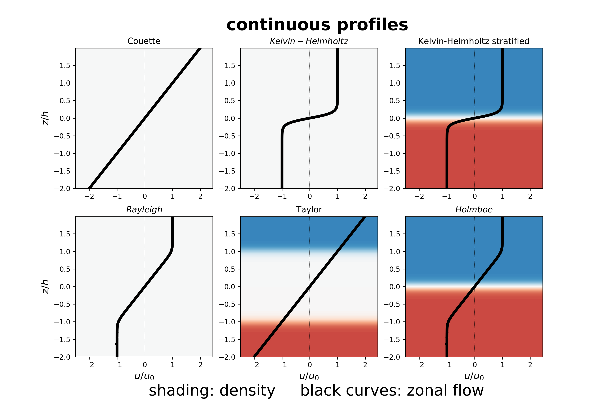
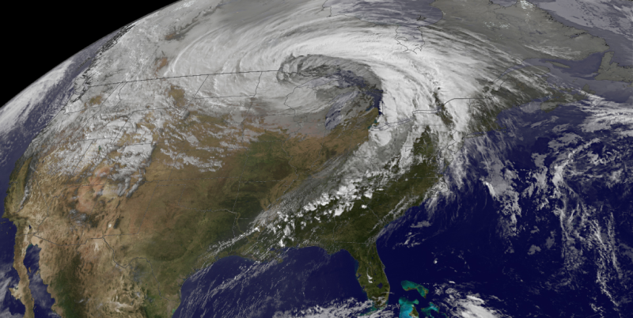

# Instabilities in Fluids - Semester 2, 2018, ANU

### Instructor: [Navid C. Constantinou][]

---

This repository contains notes and material for the class "Instabilities in Fluids" (EMSC3050/EMSC4050/EMSC8014) taught in 2018 at the Australian National University.

The main subject of the class is hydrodynamic instabilities. It is aimed to provide with the students both analytical and numerical skills to attack problems in hydrodynamic stability and also understand the underlying physical mechanisms responsible for those instabilities.

The first 2-3 lectures consist a gentle stroll through the Kelvin-Helmholtz instability, a manifestation of which is seen in the clouds over Mount Duval, NSW below:

 By <a href="https://en.wikipedia.org/wiki/User:GRAHAMUK" class="extiw" title="en:User:GRAHAMUK">GRAHAMUK</a> at the <a href="https://en.wikipedia.org/wiki/" class="extiw" title="w:">English language Wikipedia</a>, <a href="http://creativecommons.org/licenses/by-sa/3.0/" title="Creative Commons Attribution-Share Alike 3.0">CC BY-SA 3.0</a>, <a href="https://commons.wikimedia.org/w/index.php?curid=575598">Link</a>

Then each student will undertake a 2-week project with a theme from a list (to be finalized). The students will present their findings in the rest of the class. Throughout the course each student will do three projects.

## Lecture Notes

1. [Intro to Stability Theory](http://nbviewer.jupyter.org/format/slides/github/navidcy/Instabilities-in-Fluids/blob/master/lectures/01-BasicsHydrodynamicStability.ipynb#/)
2. [Hydrodynamic stability theory: Parrallel stratified shear flows](http://nbviewer.jupyter.org/format/slides/github/navidcy/Instabilities-in-Fluids/blob/master/lectures/02-BoussinesqEqs-InviscidStabilityParallellFlows.ipynb#/)
3. [Kelvin-Helmholtz instability: analytical study](http://nbviewer.jupyter.org/format/slides/github/navidcy/Instabilities-in-Fluids/blob/master/lectures/03-KH-unstratified-analytical.ipynb#/)
4. [Kelvin-Helmholtz instability: numerical study](http://nbviewer.jupyter.org/format/slides/github/navidcy/Instabilities-in-Fluids/blob/master/lectures/04-KH-unstratified-numerical.ipynb#/)

## Some project examples

A few example of proposed projects include:

### Classical instabilities

Stability analysis of classical textbook hydrodynamic instabilities with basic states that consist of a flow **u**(x, y, z) = (U(z), 0, 0)  and density ρ(x, y, z) = ρ(z), like:

### Rayleigh-Benard Convection

[Courtesy of the Institute of Theoretical Physics, WWU Münster]

### Extra-tropical cyclones

[Courtesy of NOAA / GOES / NASA]

[Navid C. Constantinou]: http://www.navidconstantinou.com
