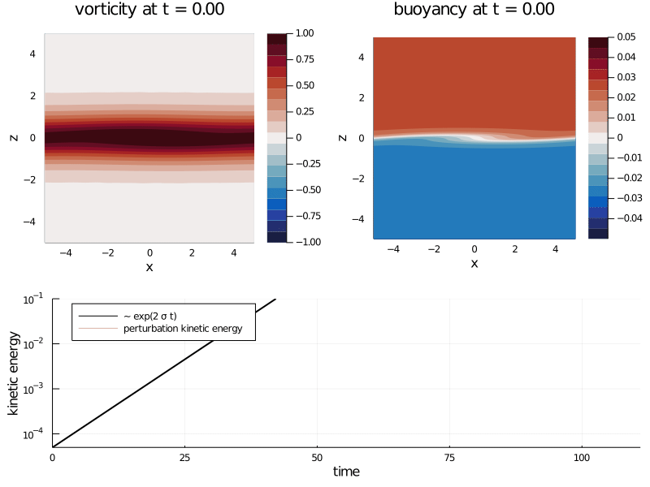

# Instabilities in Fluids - Semester 2, 2018, ANU

### Instructor: [Navid C. Constantinou][]

---

This repository contains notes and material for the class "Instabilities in Fluids" (EMSC3050/EMSC4050/EMSC8014) taught in 2018 at the Australian National University.

The main subject of the class is hydrodynamic instabilities. It is aimed to provide with the students both analytical and numerical skills to attack problems in hydrodynamic stability and also understand the underlying physical mechanisms responsible for those instabilities.

The first 2-3 lectures consist a gentle stroll through the Kelvin-Helmholtz instability, a manifestation of which is seen in the clouds over Mount Duval, NSW below:

 By <a href="https://en.wikipedia.org/wiki/User:GRAHAMUK" class="extiw" title="en:User:GRAHAMUK">GRAHAMUK</a> at the <a href="https://en.wikipedia.org/wiki/" class="extiw" title="w:">English language Wikipedia</a>, <a href="http://creativecommons.org/licenses/by-sa/3.0/" title="Creative Commons Attribution-Share Alike 3.0">CC BY-SA 3.0</a>, <a href="https://commons.wikimedia.org/w/index.php?curid=575598">Link</a>

Then each student will undertake a 2-week project with a theme from a list (to be finalized). The students will present their findings in the rest of the class. Throughout the course each student will do three projects.

## Some project examples

A few example of proposed projects include:

### Classical instabilities

Stability analysis of classical textbook hydrodynamic instabilities with basic states that consist of a flow **u**(x, y, z) = (U(z), 0, 0)  and density ρ(x, y, z) = ρ(z), like:

### Rayleigh-Benard Convection

[Courtesy of the Institute of Theoretical Physics, WWU Münster]

### Extra-tropical cyclones

[Courtesy of NOAA / GOES / NASA]

## Lecture Notes

1. [Intro to Stability Theory](http://nbviewer.jupyter.org/format/slides/github/navidcy/Instabilities-in-Fluids/blob/master/lectures/01-BasicsHydrodynamicStability.ipynb#/)
2. [Hydrodynamic Stability: Parrallel stratified shear flows](http://nbviewer.jupyter.org/format/slides/github/navidcy/Instabilities-in-Fluids/blob/master/lectures/02-BoussinesqEqs-InviscidStabilityParallellFlows.ipynb#/)
3. [Notes on exponential solution in linear systems](http://nbviewer.jupyter.org/format/slides/github/navidcy/Instabilities-in-Fluids/blob/master/lectures/exponentialsolutions.ipynb#/)
4. [Notes on material lines and vorticity lines in an inviscid fluid](http://nbviewer.jupyter.org/format/slides/github/navidcy/Instabilities-in-Fluids/blob/master/lectures/VortexLines.ipynb#/)
5. [Kelvin-Helmholtz instability: analytical study](http://nbviewer.jupyter.org/format/slides/github/navidcy/Instabilities-in-Fluids/blob/master/lectures/03-KH-unstratified-analytical.ipynb#/)
6. [Kelvin-Helmholtz instability: numerical study](http://nbviewer.jupyter.org/format/slides/github/navidcy/Instabilities-in-Fluids/blob/master/lectures/04-KH-unstratified-numerical.ipynb#/)
7. [Intro to Generalized Stability Theory](http://nbviewer.jupyter.org/format/slides/github/navidcy/Instabilities-in-Fluids/blob/master/lectures/05-BasicsNonmodalStability.ipynb?flush_cache=true#/)
8. [The Eady model of baroclinic instability: modal and non-modal energy growth](http://nbviewer.jupyter.org/format/slides/github/navidcy/Instabilities-in-Fluids/blob/master/lectures/06-QG-EadyModel.ipynb?flush_cache=true#/)

In addition, the `lectures` folder also contains a reactive notebook named [`nonnormalgrowth101.jl`](https://github.com/navidcy/Instabilities-in-Fluids/blob/master/lectures/nonnormalgrowth101.jl) that was created with [Pluto.jl](https://github.com/fonsp/Pluto.jl) and was used during an introductory discussion regarding non-normality at the Climate and Fluid Physics Group at ANU (August 2020).

## Projects #1

Below is a list for the first projects (final)

| # |   Theme      |  Reading |
|:-:|-------------|------|
| 1 |  Study of stratified Kelvin-Helmholtz profile: Analytical, numerical. Mechanistic interpretation through edge-wave interactions.  (Nick - [project report](projectreports/Project1-StratifiedKH.pdf)) | Drazin & Reid (2004) ch. 1, pp. 14-22; Vallis (2017), ch. 9.1-9.2, pp. 335-345 (or in the 2006 edition, ch. 6.1-6.2) |
| 2 |  Study of Rayleigh's profile: Analytical, numerical. Mechanistic interpretation through edge-wave interactions. (Ruth - [project report](projectreports/Project2-Rayleigh.pdf)) | Drazin & Reid, pp. 144-147; Vallis (2017), ch. 9.1-9.2, pp. 335-345 (or in the 2006 edition, ch. 6.1-6.2) |
| 3 |  Study of Taylor's profile: Analytical, numerical. Mechanistic interpretation through edge-wave interactions. (Fergus - [project report](projectreports/Project3-Taylor.pdf)) | Drazin & Reid, pp. 144-147; Vallis (2017), ch. 9.1-9.2, pp. 335-345 (or in the 2006 edition, ch. 6.1-6.2) |
| 4 |  Study of Holmboe's profile: Analytical, numerical. Mechanistic interpretation through edge-wave interactions. |  |
| 5 |  General instability criteria for parallel shear flows (stratified and unstratified): Squire's theorem. The Rayleigh and Fjortoft's criteria for unstratified instabilities and the Miles & Howard criterion for stratified. (Kieran - [project report](projectreports/Project5-Stability.pdf)) | Drazin & Reid (2004) ch. 4, pp. 124-143; Charru (2011), ch. 4, pp. 104-116; Howard, *JFM* (1961) |
|   |  Geophysical fluid dynamics: baroclinic instability |  |
| 6 |  Eady's model of baroclinic instability (Xihan - [project report](projectreports/Project6-Eady.pdf)) | Vallis 2017, ch. 9, pp. 349-369 (or in the 2006 edition, ch. 6.4-6.7) |
| 7 |  Phillips' model of baroclinic instability (Shangyu - [project report](projectreports/Project7-Phillips.pdf)) | Vallis 2017, ch. 9, pp. 349-369 (or in the 2006 edition, ch. 6.4-6.7) |
| 8 |  Rayleigh–Bernard convection | Drazin & Reid book, Gayen lecture notes, Doering WHOI lectures 2008, Rayleigh 1916 paper ()? |

Projects 1-4 are closely related to the unstratified Kelvin-Helmholtz instability we discussed in class. However, I'd like you to further understand the instabilities that rise through interaction of edge-waves (i.e., the waves that "live" on the discontinuities of the velocity shear profiles or the discontinuity of the density profiles). Project 4 might be slightly harder than Projects 1-3 in terms of algebra but not in terms of concepts.

Project 5 is for the more mathematically inclined. It involves more pen-and-paper work rather than numerics. You are asked to study some theorems that help us decide a priori whether a general velocity and density basic profile is amenable to modal instability. I will suggest some numerical investigation of some basic states to demonstrate the validity of the theorems.

Projects 6-7 are a first step in studying cyclogenesis in the mid-latidute atmospheres. These projects require to work with the, so-called, quasigeostrophic equations on a beta-plane. Beta-plane is a simplified approximation of a flow on a rotating sphere; it keeps the geometry simple (cartesian) but incorporates the basic physics due to rotation. I can help you get a hold of the quasigeostrophic equation if you haven't been familiarized with them before.

Project 8 involves the classical Rayleigh-Benard convection instability (2D) for two horizontal plates (hot plate below; cold plate on top).

## Problem set for midterm break

[Problem sets (to be submitted Sep 19th)](http://nbviewer.jupyter.org/format/slides/github/navidcy/Instabilities-in-Fluids/blob/master/lectures/ProblemSet.ipynb?flush_cache=true#/)

## Projects #2

Next follows a (non-finalized) list for projects to come:

| # |   Theme      |  Reading |
|:-:|-------------|------|
| 8 | Study of the Couette profile: The illusive theorem by Squire. Transient perturbation growth of 2D perturbations and the Orr mechanism. (Shangyu - [project report](projectreports/Project8-OrrMechanism.pdf)) | Boyd 1983, Farrell & Ioannou 1993 |
| 9 | Transient perturbation growth in Rayleigh's profile.  |  |
| 10 | The problems arising from eigenanalysis of non-normal operators & Singular Value Decomposition  (Fergus - [project report](projectreports/Project10-SVD.pdf))|  |
| 11 | Hydrodynamic stability without eigenvalues. Spectra & pseudospectra and subcritical transition to turbulence. (Kieran - [project report](projectreports/Project11-PseudoSpectra.pdf))| Trefethen & Embree 2005, Trefethen et al. 1993 |
| 12 |  Transient perturbation growth and optimal excitation of Eady's model. (Nick: transient growth of 3D perturbations - [project report](projectreports/Project12-3DEady.pdf); Xihan: Contribution of the Continuous versus Discrete spectrum on transient non-normal growth - [project report](projectreports/Project12-ContVSDiscreteEady.pdf); Ruth: Modal and non-normal growth in the Eady problem with a topographic slope - [project report](projectreports/Project12-EadyTopography.pdf))| lecture notes |
| 13 |  From Rayleigh–Bernard to chaos: Lorenz’s butterfly effect | Lorenz 1963 |

Project 8 deals with the Couette profile. As we discussed briefly in class the Couette profile is *modally* stable but still it does show finite-time perturbation growth. This project will involves first the discussion of Squire's theorem (see Lecture 3). Then finding the analytic solutions for the initial value problem for 2D and 3D perturbations of the Couette profile. Lastly, some discussion of the relations of the energy evolution of 2D and 3D perturbations and the connection with Squire's theorem.

Project 9 studies the transient energy growth and optimal excitation (adjoints versus eigenmodes) of the classic piecewise profiles in project 2. Similarly, projects 12 and 13 for the baroclinic instability problems studies in projects 6 and 7.

Project 10 presents the problems arrising from eigenanalysis of non-normal operators (i.e. when the eigenvectors are not orthogonal to each other) and shows how singular value decomposition provides for a robust, orthonormal basis related with linear operators, which also has physical meaning..

Project 13 studies the classic paper by Lorenz in which he discovered chaos in a low-order truncated system of Rayleigh-Benard convection.

[Navid C. Constantinou]: http://www.navidconstantinou.com
